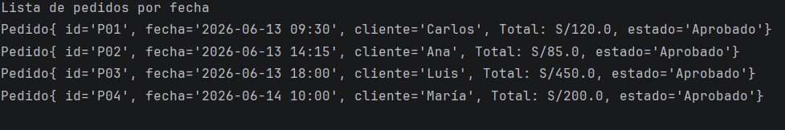

# Desarrollo de un sistema de gestión de citas
 sistema donde interactua el administrador, el cual le permite recorrer los pedidos registrados con el fin de verificar la información y tomar decisiones.

### Patrón de diseño: Iterator
Permite recorrer una colección de objetos  sin exponer su estructura interna

#### Tipo de Recorrido: por fecha
El iterador recorre las citas ordenadas de forma cronológica ascendente por fecha (de la más antigua a la más reciente), usando String.compareTo() sobre el campo fecha en formato YYYY-MM-DD HH:mm para comparar dos fechas caracter a caracter con el fin de determinar cual va primero.

#### Resultado:
